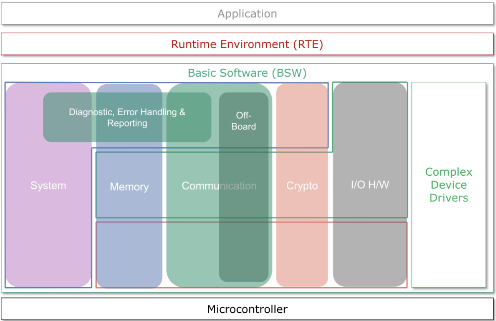
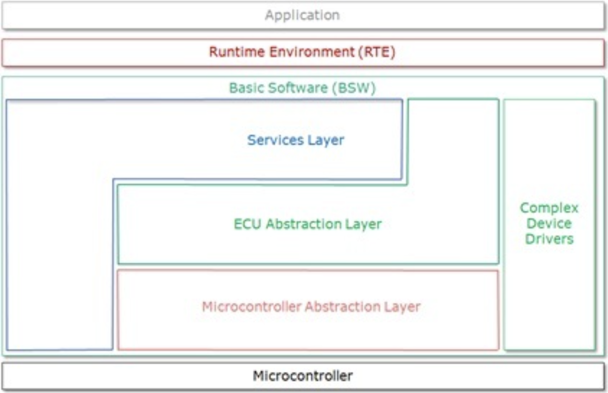

# 클래식 오토사 아키텍처

- ASW (Application SoftWare)
    - 오토사 사양서에서 정의하는 Application Software Component가 위치하며, 하위 계층(BSW)의 인터페이스 형태에 종속적이지 않는 기능을 구현할 수 있도록 설계됨. 
- RTE
    - 주로 애플리케이션 계층과 베이직 소프트웨어 계층간의 인터페이스를 연결해 주는 역할을 하는 계층. 
    - 태스크 매핑 등 다른 중요한 역할도 수행
- BSW
    - 오토사라면 RTE를 포함한 BSW를 생각할 만큼 사양서의 많은 부분도 BSW의 기능을 기술하는데 할당되어 있다.
    - 이 계층에서는 ASW가 동작하기 위해 필요한 정보( 하드웨어 신호값, 네트워크 신호값, 스케줄링, ASW 흐름 관찰기능 )를 제공하며 특정 기능 모듈은 하드웨어 의존적인 특성을 가지게 된다. 
- 추가
    - RTE를 포함한 BSW 계층을 흔히 Linux, Windows와 같은 운영체제 영역으로 치부할 수 있다. 
    - 하드웨어 사양이 제한되는 차량 제어기용으로 고안된 구조인지라 기존 PC 운영체제와는 지원되기능면에서 많은 부분이 부족하다. 
    - 하지만, 이미 오토사에 기술된 사양만으로도 일반적인 차량용 제어기를 구현하는 데는 무리가 없다. 

## 계층 관점

> 베이직 소프트웨어 내 세 계층에 대해 알아보자.
1. 서비스 계층 (Service Layer)
- 주로 어플리케이션에 bsw에서 제공하는 기능을 서비스 형태로 제공. 
- Communication Manager(ComM)와 같이 모듈명 뒤에 Manager 또는 Management라는 접미사가 붙는다.
- Com(Communication)과 같이 붙지 않는 경우도 있음.
- 주요 서비스
    - 통신 및 채널 관리 서비스
    - 진단 기능 서비스
    - 제어기 상태 관리 서비스
    - 태스크 스케줄링 서비스스
    - 비 휘발성 메모리 서비스
    - 와치독 서비

2. 제어기 추상화 계층 (ECU abstraction layer)
- 제어기 하드웨어에 종속적이지 않은 일정한 인터페이스를 서비스 및 애플리케이션 계층에 제공.
- Memory Abstraction Interface와 같이 모듈명 뒤에 Interface라는 접미사를 붙임.
- 주요 추상화 대상
    - 통신 인터페이스 (CAN, LIN 또는 Ethernet Driver)
    - 메모리 인터페이스 (Internal/External flash, EEPROM 인터페이스)
    - 입출력 인터페이스 (ACD, GPIO Abstraction Interface)
    - 와치독 인터페이스 (Internal/External Watchdog interface)

3. 마이크로 컨트롤러 추상화 계층 (Mircocontroller Abstraction Layer)
- 흔히 엠칼(MCAL)로 불리며 마이크로 컨트롤러에 종속적이지 않은 일정한 인터페이스를 추상화 계층에 제공.
    - 상이한 하드웨어 설계를 가지는 마이크로 컨트롤러로 부터 동일한 하드웨어 인터페이스를 추상화 계층에 제공.
- 주요 추상화 모듈
    - 통신 모듈
    - 메모리 모듈
    - 입출력 모듈
    - 와치독 모듈

## 기능 관점
오토사 소프트웨어 구조는 다음과 같은 기능 관점으로 나누어 볼 수 있다. 
- 시스템 기능
- 메모리 기능
- 통신 기능
- 암호 기능
- 입출력 하드웨어 기능
- 진단 및 에러처리 기능
- 오프보드 통신 기능.

> 출처 : https://autosw.tistory.com/12, https://autosw.tistory.com/13