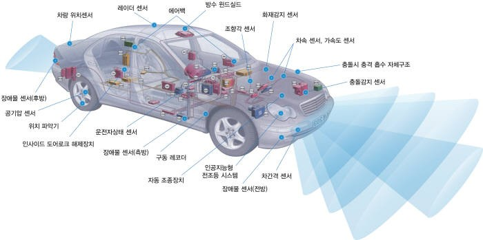

# ECU (Electronic Control Unit)
- 전자제어장치
- Engine Control Unit의 약자로 엔진제어장치로 불렸지만, 최근에는 전자 기술의 발달로 자동차에 각종 전자 장치가 장착되면서 Electronic Control Unit로 사용되고 있다. 
- 엔진과 관련된 각종 센서에서 수집된 정보를 토대로 최적 연소를 통해 엔진 효율을 높인다.
- 운전자의 의도대로 엔진을 최적 제어해 주기 위해 엔진을 제어하는 컴퓨터다. 
- 엔진의 회전수, 변속 시기, 제동장치, 안전장치 등 차량의 모든 부분을 제어 

# 전자제어장치 종류

- ABS (Anti-lock Breaking System) : 브레이크 잠김 방지 
    - ABS는 바퀴의 잠김 상태를 감지하여 타이어가 정지하면 자동으로 브레이크를 풀었다 걸었다 하며 브레이크가 완전히 잠기는 것을 방지
    - 타이어에 회전력을 주면서 제동력을 높여주는 기능
- TCS (Traction Control System)
    - 접지력을 조절해주는 시스템으로 미끄러운 노면에서 차량을 출발하거나 가속할 떄 과잉 구동력이 발생해 타이어가 공회전하지 않도록 차량의 구동력을 제어
    - 타이어가 미끄러졌을 때 좌우 타이어의 회전수 차이가 난다면 컴퓨터가 이를 탐지하여 자동으로 엔진 출력을 떨어뜨려 휠 스핀을 방지 
    - 브레이크를 작동시켜 미끄러짐을 방지 
- VDC (Vehicle Dynamic Control)
    - 차체 미끄러짐을 방지하는 기능
    - 운전자가 차량을 통제하기 힘든 위험한 상황에서 엔진 토크와 브레이크가 개입해 차체를 제어 
    - 차가 구동하는 동안 바퀴 미끄러짐을 조절하는 TCS, ABS, EBD 등 모든 시스템을 한꺼번에 제어
    - 차량이 코너를 돌 때 접지력을 잃고 이탈하는 현상인 언더 오버스티어 등 발생하는 것을 방지
- TPMS (Tire Pressure Monitoring System)
    - 타이어 공기압 감지 시스템으로 타이어의 공기압과 온도를 감지하여 ECU로 보내고, ECU의 판단에 공기압이 지나치게 낮거나 높아지면 계기판에 경로를 띄우는 장치
    - 타이어 공기압이 지나치게 낮을 경우 접지면이 넓어지면서 마모가 심해지고 지면과의 마찰이 심해지는 만큼 연료 소모량이 많아져 연비가 나빠짐. 
    - 반대로 타이어 공기압이 지나치게 높을 경우 통통 튀는 승차감으로 승차감이 좋지 못하며, 브레이크를 잡았을 때 미끄러지는 증상이 나타날 수 있음.
    - 이러한 타이어의 결함을 막고 운전자에게 타이어의 공기압을 알려주는 안전장치
- AFS (Air Flow Sensor) 
    - 공기유량센서
    - 엔진으로 유입되는 공기량을 검출하여 ECU로 보낸다.
    - ECU는 이 신호를 받아 연료 분사량을 결정
    - 분사 신호를 인젝터로 보내 연료를 분사시킴
    - 공기 유량 센서의 종류에는 
        - 흡입 공기량 계측 방식인 에어플로미터식 (베인식)
        - 칼만 와류식
        - 열선식
        - 흡입 압력 검출 방식인 MAP 센서가 있음

- TPS (Throttle Position Sensor)
    - 가솔린 분사 장치에서 스로틀 밸브의 위치를 검출하는 센서
    - 스로틀 위치 센서
    - 스로틀 밸브가 공회전 위치나 어떤 정해진 위치 이상으로 되어 있을 때 스로틀 위치 센서 등의 입력을 받아 ECU에서 인젝터의 개변 시간을 조절하여 연료의 양을 조절하면서 가솔린 엔진의 출력을 조절

- ECTS (Engine Cooling water Temperature Sensor), WTS(Water Temperature Sensor)
    - 엔진의 냉각수온에 대한 정보를 ECU에 전해주는 저항식 센서
    - 엔진 냉각수온 센서라고도 함
    - 인젝터를 통해 분사된 연로는 온도가 높을 경우 연소가 잘 된다. 
    - 하지만 냉각된 상태에서는 연료를 무화상태로 분사하더라도 연료들 간에 서로 뭉치는 현상이 발생하여 완전연소를 시킬 수 없으며 냉간 시동이 어렵다. 
    - 엔진 냉각수온 센서는 이러한 이유로 인해 흡기 매니폴드의 냉각수 통로에 장착된다
    - 냉각수의 온도를 검출하여 아날로그 전압으로 ECU에 입력시킨다. 
    - 온도 변화에 따른 출력 전압을 토대로 ECU는 엔진의 워밍업 상태를 판단하고 엔진의 냉간 시에는 연소를 원활하게 하고 시동성을 좋게 해준다. 

- ATS (Air Temperature Sensor) 
    - 흡기 온도센서
    - 공기유량센서(AFS)에 부착되어 흡입한 공기의 온도를 검출하는 일종의 가변저항기인 부특성 서미스터입니다. 
    - ECU는 센서로부터 출력전압에 의해 흡입 온도를 감지하여 흡입된 공기의 온도에 대응하는 연료분사량을 보정한다. 

- BPS (Barometric Pressure Sensor) 
    - 대기압 센서
    - BPS는 AFS에 부착되어 자동차가 위치한 지역의 대기압력을 축정해 ECU로 신호를 보낸다. 
    - ECU는 이 신호를 이용해 차의 고도를 계산하여 적정한 공연비가 되도록 연료 분사량과 점화 시기를 조정
    - 대기압 센서는 스트레인 게이지의 저항값이 압력에 비례하여 변화하는 것을 이용하여 압력을 전압으로 변환시키는 반도체 피에조 저항향 센서이다. 

- 노크센서 (Knock Sensor)
    - 엔진의 효율 향상을 위해서는 엔진의 압축비가 높아야한다. 
    - 압축비가 상승하면 연소 최대 압력이 증가하여 엔진의 효율은 좋아지지만 노킹의 발생 가능성도 높아진다. 
    - 노킹이란 엔진의 이상연소로 인한 것으로 엔진의 정상적인 연소는 점화불꽃에 의하여 혼합기가 착화되고 착회된 화염면이 전파되면서 이러우진다. 
    - 화염면이 정상적으로 도달되기 전에 국부적으로 자기착화에 의해 급격히 연소가 이루어지는 경우가 있다. 
    - 이 이상연소로 인해 발생하는 급격한 압력상승 때문에 실린더 내의 가스가 진동하여 충격적인 타격음을 발생시키게 되는데 이것이 노킹이다. 
    - 노크센서는 피에조 소자를 이용하여 엔진연소 중 발생되는 진동을 전기신호로 바꾸어 ECU로 보내주게 된다. 
    - ECU는 이 신호를 이용하여 노킹이 발생하는지 안하는지를 판단.
    - 노크가 발생됐다고 판단하게 되면 ECU는 점화시기를 지각시켜 노크를 저감시키게 된다.
    - 전자유도식 노크센서
    - 압전식 노크센서

# CAS (Crank Angle Sensor) 
    - 크랭크 각 센서
    - 크랭크 각 센서는 상사점에 관련된 크랭크샤프트의 위치를 감지하는 센서다
    - 디스크리뷰터 내에 내장되어 있는 방식과 플라이휠에 부착된 방식이 있다
    - ECU는 이 센서에서 나오는 신호를 기초로 하여 연료 분사시기를 결정
    - 엔진 1회전당 흡입 공기량, 점화 신호 시기 등을 게산

# ISC (Idle Speed Controller) 
    - 공회전속도조절장치
    - ISC 시스템은 Idle(공회전) 상태에서 부하에 의해 떨어진 엔진 출력만큼 흡입되는 공기량을 증가시켜 엔진 출력 부족으로 발생할 수 있는 엔진부조 현상을 방지하는 장치

# 공회전 스위치 센서 (Idle Switch Sensor)
- 스로틀 보디에 독립적으로 설치된 방식과 TPS(스로틀 위치 센서)에 내장된 방식이 있다. 모두 접점식이며 스로틀 밸브가 공전상태에 있으면 ON 신호가 ECU로 입력된다. 
- ECU는 이 신호에 의해 적정한 공전상태를 제어
- 아이들 스위치가 정상적으로 작동하지 않을 때에는 가속불량으로 이어질 수도 있고, AT의 경우는 기어 변속상태가 잘 이루어지지 않을 수도 있다. 
