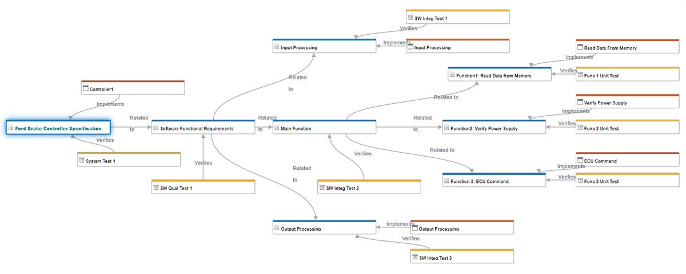
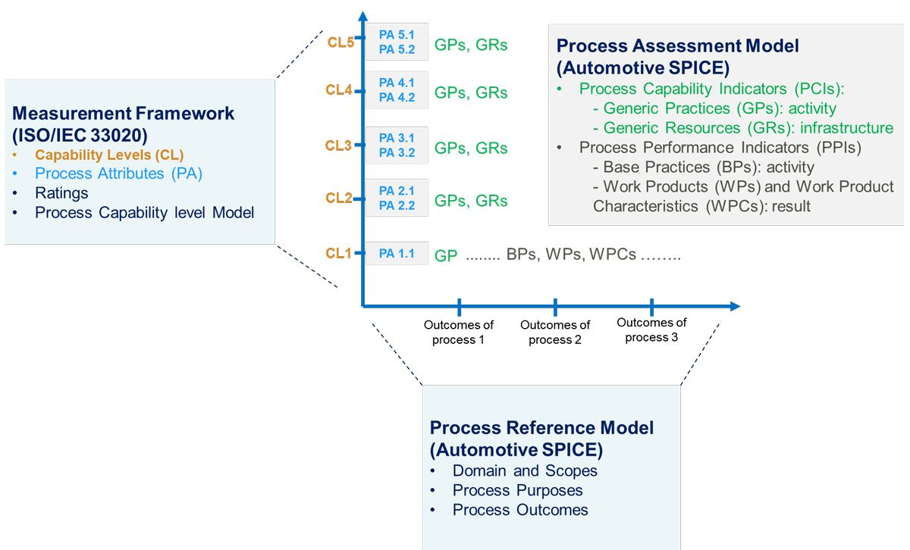

# ISO-26262
- 자동차 기능 안정성 국제 표준
- 차량의 기능안정성 관리
- 구상 단계
- 제품 개발
- 생산 및 운영
- 지원 프로세스 등..
- 개발 초기부터 생산, 폐기에 이르는 전체 생명주기에서 안전 관련 요구사항 포함.

# A-SPICE
- Automotive Software Process Improvement and Capability dEtermination
- 자동차 공급망 조직은 A-SPICE를 통해 자체 공정뿐만 아니라 공급업체 공정의 역량 수준을 평가하고 개선가능.
- 실질적으로는 A-SPICE를 통해 고객(OEM 및 다계층 공급망)이 공급업체 선정 과정 중 공급업체의 공정을 평가할 수 있다.

### 모델 기반 설계

- 모델 기반 설계와 모델 기반 시스템 공학을 사용하면 개발 라이프사이클 전반에 걸쳐 아티팩트 사이에서 디지털 스레드를 유지할 수 있다. 
- 이는 A-SPICE의 핵심 원칙. 

### A-SPICE의 차원

- A-SPICE에는 두 가지 차원이 있다.
- PRM (공정 참조 모델)
- 측정 프레임워크
- A-SPICE 공정을 평가하기 위한 2차원 프레임워크: 특정 공정은 PRM에서 선택되고 해당 역량 수준은 증거를 기반으로 하여 평가. 

# AUTOSAR

- AUTomotive Open System ARchitecture
- 자동차를 구성하는 많은 전자 제어 장치(ECU : Elctronic Control Unit)에 공통적으로 적용할 수 있도록 설계 됐다. 
- AUTOSAR는 BSW Layer에 속한 각 서비스들을 BSW 모듈이라고 부르고, ASW에 속한 컴포넌트를 SW 컴포넌트고 부른다. 
- 다만, BSW Layer 내에서도 AUTOSAR OS, WatchDog, COM 등의 일부 예외적인 모듈을 제외한 나머지 대부분의 BSW 모듈은 모두 Service SW 컴포넌트에 해당되기도 합니다.
- **즉, AUTOSAR는 SW 컴포넌트들로 구성된 SW 아키텍처라고 표현해도 크게 문제 되지는 않습니다.**

### autosar 개발 분류 및 과정
- BSW configuration : Configuration tool 사용
    - OS Configuration
    - MCAL Configuration
    - BSW 모듈 Configuration
- ASW SW Component
    - AUTOSAR meta-model(autosar 설계 언어)를 사용한 설계 방식으로 개발.
    - 설계를 위한 문법 및 활용법은 AUTOSAR_TPS_SoftwareComponentTemplate.pdf 스펙에 설명되어 있다.
- RTE Generation Phase
    - 최동 단계를 통해 자동 생성되는 코드는 모두 헤더파일(.h) 구현파일(.c) 파일이다
    - BSW 모듈과 RTE는 수정할 수 없는(수정하면 안되는) 100% 자동 생성 코드이다
    - ASW의 SW Component는 "Rte_SW 컴포넌트 이름.h" 파일만 자동 생성.

### AUTOSAR의 특징
- Layered Architecture
- SW 컴포넌트와 RTE의 참조관계 
    - 각 SW 컴포넌트는 상호 직접 참조하지 않느다.
    - SW 컴포넌트는 RTE와만 참조 관계를 맺는다.

- BSW와 ASW의 통신은 RTE를 거친다. 
- OS, Framework으로 볼 수 있다.
- AUTOSAR meta-model이라는 설계 언어를 제공
    - UML 2.0 meta-model을 기반으로 자동차 도메인에 맞게 확장/변형한 meta-model이다.
    - 설계는 UML의 컨셉인 객체 지향 컨셉으로 설계
    - 생성되는 코드는 객체지향언어가 아닌 절차지향 c언어로 생성.