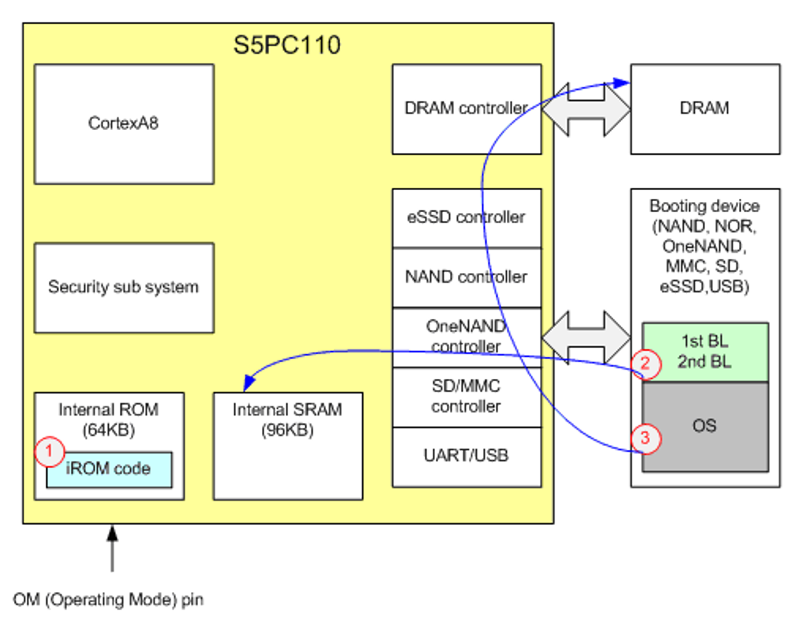

## BL0 (boot-rom or pre-boot loader)
- iROM에 저장된 코드 영역 - ROM Code
- 크게 두 가지 작업 수행
    - 디바이스 환경설정과 프라이머리 페리페럴의 초기화
    - 다음 부트로더(SPL)를 위한 디바이스 준비
- OM pin으로부터 부팅 매체를 찾아 BL1을 iRAM(SRAM)으로 읽어들인다. 
- 이후 제어권을 BL1으로 넘김.

## BL1 (first boot loader)
- 일반적으로 SRAM이 U-Boot와 같은 전체 부트로더를 로드하기에 충분히 크지 않기 때문에 필요한 단계
- booting device 처럼 외부 메모리에 저장되어 있는 코드 영역
- NAND/MMC and DRAM controller 등의 초기화 진행
- second boot loader 로딩
- 부팅 장치(nand나 sd카드)에 저장된 BL2를 읽어서 메모리로 로딩&실행.
- 이후 제어권을 BL2로 넘김

## BL2
- 일반적으로 u-boot이나, BLOB, grub과 같은 널리 알려진 Boot Loader가 사용됨
- cpu, clock, uart, memory 등의 중요한 초기화 작업 수행
- 커널을 dram에 올려 os loading 수행
- 커널로 제어권 넘김

## 부팅흐름
1. 시스템이 리셋되면 iROM부터 PC가 시작된다.
    - BL0을 수행하는 단계이다. OM pin으로부터 부팅매체를 찾아 디바이스로부터 BL1을 iSRAM으로 읽어들인다. 
2. 제어권을 넘겨받은 BL1은 BL2를 로딩한다.
    - BL1을 수행하는 단계로, 부팅 장치(nand나 sd카드)에 저장된 BL2를 읽어서 메모리로 로딩 & 실행한다. 
3. BL2는 일반적으로 u-boot나 BLOB, grub과 같은 널리 알려진 Boot-loader가 수행되는 단계이다.
    - BL2를 수행하는 단계로 초기화 작업을 수행한 뒤 커널을 메모리에 올려 로딩한다. 
4. 해당 글은 ARM SECURE BOOT PROCEDURE와 관련된 내용을 자세히 설명한다.
