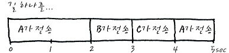
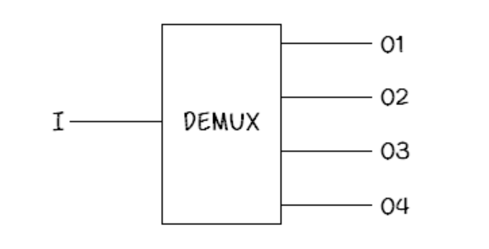
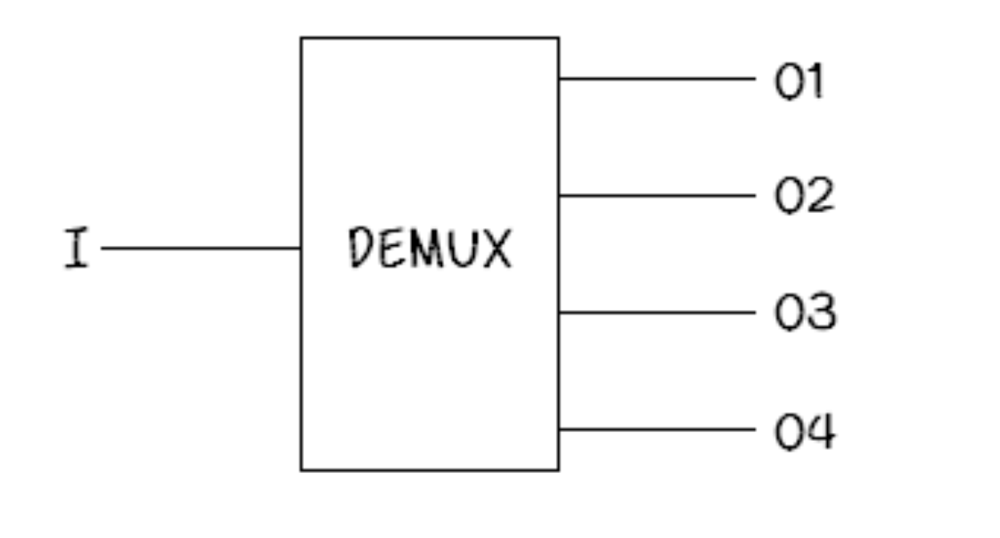
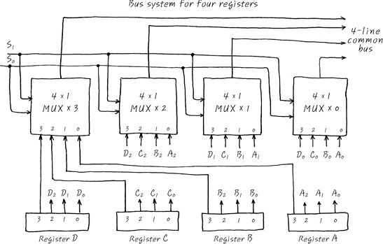

# Bus
- Bus란 장치들이 정보 공유를 위해서 공유하는 선들의 집합이라고 한다.
- 어떤 한 특정 시점에서시간을 멈추어 Bus를 쳐다 본다면, Bus위에는 그 당시에 Bus를 쓸 수 있는 허가를 받은 장치들의 신호만이 보인다
- A와 B를 wire로 연결하여 A - B 로 만들어 놓은 다음에 A에서 B로 data를 전송하면, 전기 신호도 빛의 속도와 마찬가지의 속도로 이동을 하니, 이동이라기 보담은 wire - 위에는 A가 보낸 신호가 wire 위에 떠 있다

# clock과의 관계
- 마구 엉킨 bus system은 clock에 맞추어 한 clock의 시간을 쪼개어 봤을 때, 한가지 종류의 신호만이 존재하게 되는것이며, 계속 시간을 흘려 보내면서 관찰했을 때는 각 clock 단위 시간마다 번쩍 번쩍 하면서 다른 종류의 신호들이 네온 사인 처럼 나타났다가 사라지는 것이다. 

- 그러니까, bus로 통신할 필요가 있는 여러개의 회로들을 엮어 놓으면,clock에 따라 - 시간에 따라 - 서로 통신할 필요가 있는 것들끼리의 신호가 bus line에 떠 있는거죠. 번쩍 번쩍 나타났다 사라졌다.

- 
- 위 사진과 같이 클락 신호에 따라 특정 장치가 bus를 독점한다고 이해할 수 있다. 

# MUX, DEMUX
- 
- MUX (다중화기) : 여러 개의 입력 신호 중 원하는 신호를 선택해서 출력

- 
- DEMUX (역다중화기) : 하나의 입력 신호를 여러 개의 출력 중 하나를 선택해서 출력.

# Register bus

- 그림 같은 경우는 Mux를 이용한 Register끼리의 통신 통로로서의 Bus다. 
- 1 bit 씩도 transfer 가능하며, 공통 버스를 이용하는 시스템인 셈입니다. 각각의 register는 4bit latch이며, 4개의 MUX에 연결되어 있습니다.
- 버스에는 주소버스, 데이터버스, 제어 및 상태버스 등의 3가지 종류의 버스가 있다.
- 주소 버스에는 현재 MCU가 access하려는 주소가 번쩍거리고 그러니까 MCU에서 나오는 단방향신호입니다. 
- 데이터버스는 양방향으로서 MCU가 data를 주거나 받을 수 있습니다. 제어버스는 단방향일수도 양방향일 수도 있는데, MPU가 참조하려는 상태에 관한 정보들이 번쩍 번쩍 합니다.
- Arbitation
    - bus에 물린 device 에 대한 동작 중계 장치
    - 여러 개의 디바이스가 버스를 동시에 쓰려고 하는 경우 중재의 역할을 함

