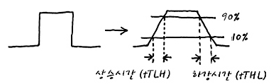
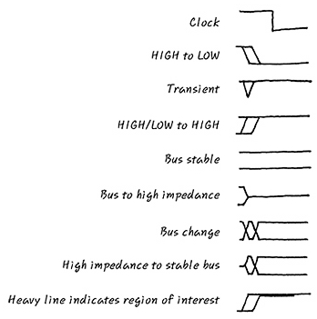
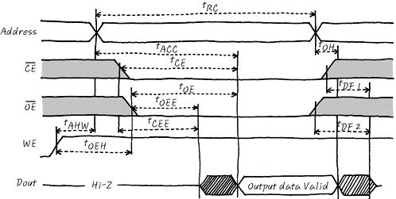
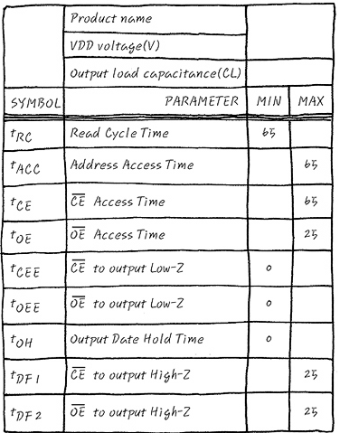

# 스위칭

- 게이트에서는 입력신호가 들어온 후 출력신호가 나오기까지 약간의 시간이 걸린다.
- 그 시간을 전달 지연시간이라고 부른다. 그리고 전달 지연 시간에 관한 전기적 특성을 **스위칭 특성**이라고 부릅니다.
- 예를 들어 펄스 하나를 게이트 IC에 입력하는 경우 그림과 같이 펄스는 실제로는 타이밍 차트상에서 완전한 사격형이 아닌 사다리꼴의 모양이 된다. 
- Analog 신호와 Digital 신호에서 언급한 대로 신호의 변화란 만만치 않은 변화 이지요.
- 이상적이지 않은 완벽한 네모꼴의 디지털 세계가 아니기 때문에 사다리 꼴이 되는 걸 이해해 주세요

# notation

# Timing Diagram

# Timing Data Sheet
