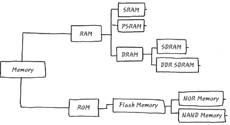
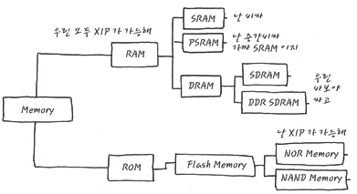

# Memory Map

- RAM : 휘발성 메모리
- ROM : 비휘발성 메모리 

# XIP (Execute in Place)
- XIP는 메모리 상에서 직접 program/code를 실행 할 수 있는 기술
- 기본조건으로 Random Access가 가능해야 한다. 
- Byte, Word 등의 크기를 직접 Access가 가능해야 한다는 뜻이고, 모든 RAM은 이런 요견을 충족
- RAM에 program/Execution image를 올리기만 하면 실행 가능. 
- random access : 어떤 파일내에 있는 특정한 레코드를 찾을 때 다른 레코드를 순차적으로 읽지 않고 원하는 레코드만을 직접 엑세스 하기 때문에 데이터를 빨리 검색 할 수 있다. (배열과 비슷)

# 종류 별 가격
- RAM 
    - SRAM > PSRAM > DRAM
- ROM
    - NOR > NAND
    - NOR는 Cell이 병렬로 연결되어 있으며 병렬로 연결되어 있다보니, address line과 data line을 모두 가질 수 있으며, ram 처럼 byte 단위로 random access가 가능. 
    - NOR는 XIP를 지원함. 
    - NOR는 쓰기와 지우기는 느리지만 읽기가 빠름
    - NAND는 읽기는 느리지만 쓰기와 지우기가 빠름

# MCP
- Flash Memory 업체에서 flash memory와 ram을 한꺼번에 한 칩에 집적한 칩을 MCP(Multi chip package)라고 한다. 
