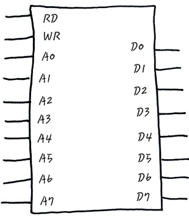
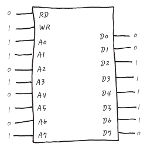
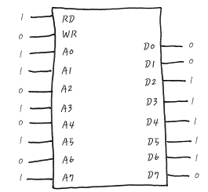

# 메모리의 물리적 동작

- Address pin
    - 위 그림의 메모리는 8개의 핀을 가지고 있다.
    - 0x00 ~ 0xFF 까지의 주소 지정 가능. 
- Data pin 
    - 위 그림의 메모리는 8개의 핀을 가지고 있다. 
    - 0x00 ~ 0xFF 까지의 값 처리 가능
    - 1byte 만큼의 값을 읽거나 쓸 수 있음.
- Read pin 
- Write pin 

# 메모리 동작 예시 
- 상황 : 0xAB(10101011)번지에 0x7C(11111100) 쓰기

- 상황 : 0xAB(10101011)번지에 0x7C(11111100) 읽기
 
