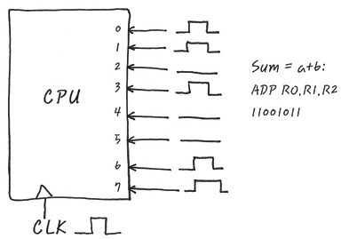
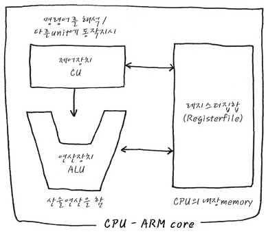
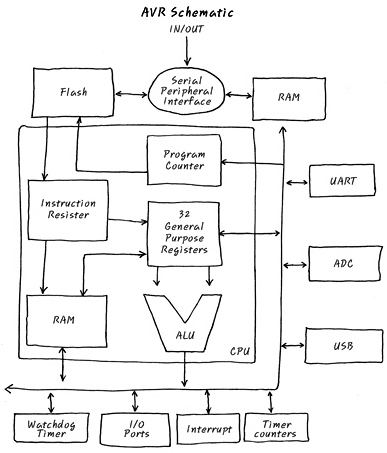

# How CPU Works

- CPU에 나와 있는 pin들에 약속된 신호를 주게 되면, 그에 대한 일을 CPU는 착실히 수행하게 된다. 

- 만일 8bit CPU에서 0~7번 pin에 약속 되어진 신호를 주게 되면 CPU는 그에 해당하는 일을 하게 되는 단순한 원리.

- 예를 들어, sum = a+b를 계산한다고 하자.
- 내부적으로 R1에 a가, R2에 b가 들어있고 결과를 R0에 저장하는 메커니즘으로 작동한다. 
- 0~7번 핀에 위의 일을 하기 위해 약속 된 11001011이라고 전기적인 신호만 준다면 CPU는 일을 할 것이다. 

# CPU 기본 구조

- CPU는 CU에서 명령어를 해석하여 다른 Unit에 동작을 지시하는 일을 한다. 
- 엄밀히 말하면 CU와 Decoder로 나눌 수 있다. 
- Decoder : 명령어를 읽어서 해석하는 일
- CU : 각종 제어 신호를 발생시킴. 예를 들어, ALU에게 더하기를 하라는 신호를 발생시킨다던가, 또는 메모리에게 특정 주소를 Read할 수 있도록 신호를 발생시킴. 
- ALU : 산술연산을 한다. 
- Register file : 산술연산이나 제어에 관련한 결과 등을 임시 저장

# AVR MCU 구조 & data flow
