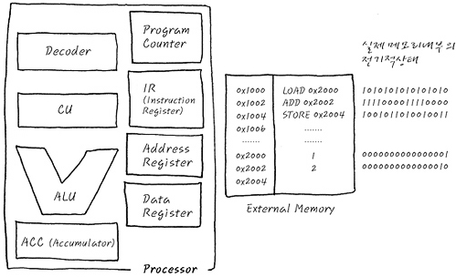
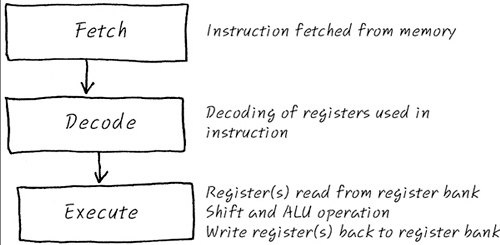
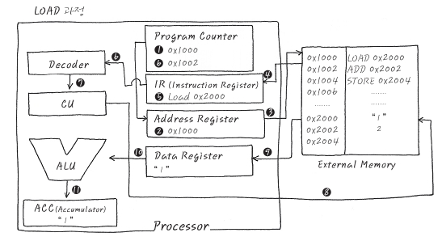
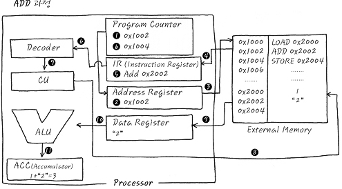
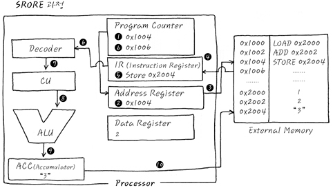
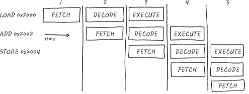

# CPU 내부 

- PC(Program Counter) : CPU가 현재 실행하고 있는 instruction의 주소를 가리킴
- IR(Instruction Register) : PC가 가리키는 Instruction의 주소에서 읽어온 instruction을 담아두는 기억장소
- Address Register : 현재 사용하는 Data를 access하기 위한 data의 주소를 가리키는 값을 담아두는 기억장소
- Data Register : Address Register가 가리키는 주소의 실제 값
- ACC(Accumulator) : 특수한 레지스터로, 연산에 사용되는 값들을 저장하며, 연산의 결과값을 잠시 저장하는 일이 많다. 외부 사용자가 직접 access할 수 있는 레지스터가 아니고, CPU 혼자 독식하는 레지스터. 
- Decoder : IR에서 가져온 instruction을 해석하여 CU에 넘김
- CU(Central Unit) : Decoder에서 받아온 것을 각종 제어 신호로 변환하여 제어신호를 발생 시킴. 
- ALU : 산술 연산을 담당하는 unit

# CPU 기본 동작 방식

1. Fetch : instruction을 메모리로부터 가져온다.
2. Decode : 가져온 instruction을 해석해서 어떤 일을 하는 녀석이냐를 알아보고 레지스터 값들도 확인 
3. Execution : 디코딩된 instruction을 실행한다. 

# 동작 예시
### LOAD

1. 현재 CPU가 실행하려는 주소는 PC에 들어있는 0x1000
2. Address register에 0x1000을 넣는다
3. Address register에 0x1000이 들어가는 순간 자동으로 memory의 0x1000을 Access한다
4. Instruction이 Memory로부터 읽어짐 (LOAD 0x2000)
5. Memory로 부터 읽혀진 Instruction
6. Instruction이 Decoder로 흘러 들어가 무슨 내용인지 해석 되는 동시에 PC는 다음을 실행하기 위하여 증가됨
7. 0x2000번지의 값을 가져오라는 내용임을 파악
8. Memory로 부터 0x2000의 값을 읽어 오라고 CU가 제어 신호를 발생시킴. (ACC에게는 임시 저장토록 제어 신호 발생)
9. CU가 발생시킨 제어 신호에 의하여 1이라는 값이 Data Register에 들어간다. 
10. 이 값은 ALU를 통하여 연산을 할지도 모르니까 ACC에 임시 저장됨. 

### ADD

1. LOAD와 마찬가지로, 현재 CPU가 실행할 주소는 앞에서 이미 증가한 0x1002이므로
2. 이 값을 Address Register에 넣음.
3. 자동으로 0x1002에 위치하고 있는 ADD 0x2002가 Load되며,
4. 이 값은 IR에 전달 된다.
5. 전달된 값은 IR에 저장되며,
6. IR의 값이 Decoder에 전달되는 동안 PC도 자동으로 다음 instruction을 가리킬 수 있도록 증가하며,
7. Decoder는 0x2002번지의 값을 더하라는 해석을 완료하여 CU에 전달한다.
8. CU는 Decoder의 해석에 의거하여 0x2002에 있는 값을 읽어 오도록 제어 신호를 발생시키며, ALU에게는 더하라는 제어 신호도 발생시킨다.
9. 0x2002에 있는 Data 2를 Load해서 Data Register에 저장한다.
10. CU가 발생시킨 제어 신호에 의하여, ALU는 Data Register에서 읽어온 data 2를 이미 있던 ACC의 값과 더하여 ACC에 결과 값을 저장한다.

### Store

1. 현재 실행해야 할 Instruction은 PC의 값인 0x1004
2. 이 값으 Address Register로 전달된다. 
3. Instruction을 load하기 위하여 0x1004를 access
4. 0x1004에 값은 CPU로 로딩된다. 
5. 로딩된 값은 IR에 저장되며 이 값은 Decoder로 전달되는 동시에 PC는 또 한번 증가.
6. Decoder는 해석
7. CU로 그 내용을 전달
8. CU는 ALU에게 ACC에 있는 값을 0x2004에 저장할 수 있도록 제어 신호를 발생
9. ACC에 있는 값은 CU가 발생시킨 제어 신호에 의하여 0x2004번지에 결과 값 3을 저장함. 

# pipeline

- ARM7 기준으로 Fetch/Decode/Execute 3 stage pipe line이다. 
- 왼쪽으로 갈 수록 시간이 지난다.
- 한 칸당 1 cycle, 즉 1 clock이다. 
- 처음 cycle에서부터 시간이 흘러 3 cycle까지 갔을 때는 첫 번째 opcode의 execute가 실행된다
- PC값은 항상 Fetch하고 있는 곳을 가리키고 있다
- 32bit가 1word라면 PC는 항상 +8 만큼 앞서간다. 

- Control Harzard
- Data Harzard