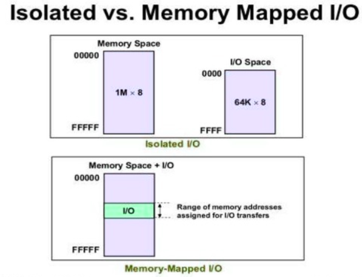

# Memory Mapped I/O
- 메모리와 I/O가 하나의 연속된 address 영역에 할당된다. 
- I/O가 차지하는 만큼 메모리 용량은 감소한다. 

- CPU 입장에서는 메모리와 I/O가 동일한 외부기기로 간주된다. 이들을 액세스 하기위해 같은 신호(read/write)를 사용한다. 

- Load나 Store 명령에 의해 수행된다. 
- 장점
    - 포트 입출력 구현 시, 복잡성이 사라지기 때문에 CPU 내부적으로 로직이 덜 필요
    - 저렴하고 빠르다
    - RISC가 추구하는 방식이다. 
- 단점
    - 주소와 데이터 버스를 많이 사용하게 되어, 메인 메모리에 접근하는 것보다 매핑된 장치에 접근 하는 것이 더 느리다. 
    - **사용시 I/O 영역 변수는 volatile 타입으로 선언해야 함(컴파일러의 최적화 방지)**
    - I/O 영역은 Non-cacheable로 설정해야 한다.
        - 캐시메모리로 접근할 경우, 변경된 내용은 가져올 수 없을수도 있다. 
    
    