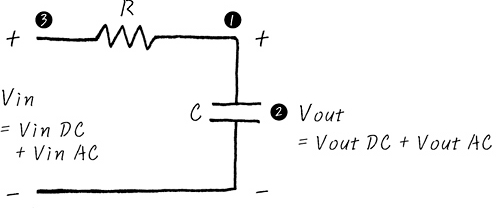

# Filter
- 필터란 무엇인가를 걸러내는 장치이다. 예시로 정수기 필터 또한 물에서 각종 세균이나 오물을 걸러내는 역할을 한다.

# LPF(Low Pass Filter)
- 저주파 성분만 통과 시키는 역할을 한다. 
- 보통 임베디드 시스템은 아주 작은 크기의 보드에다가 이것저것 밀집시켜서 만드는 경향이 있는데, 고주파 성분은 이런 보드에 Noise역할을 하기 때문에, 상당히 골치 아픈 존재다. 그러니까, 고주파 성분은 걸러내 보자 하는게, LPF이죠.
- 그림

- DC 관점에서 회로 분석
    - Open, 즉 끊어진 것과 다름 없는 회로로 볼 수 있다.
    - 캐패시터는 DC 신호를 차단시키는 역할을 하기에 캐패시터를 무한에 가깝게 큰 저항이라고 생각해도 된다.
    - 그렇게 되면 옴의 법칙에 따라 전류는 굉장히 작게 흐를 것이다
    - 그렇게 되면 그 부분에서 소모되는 전압은 굉장히 적을 것이다.
    - V_in ~= V_out
- AC 괸점에서 회로 분석
    - Short, 

# HPF
- 

# BPF