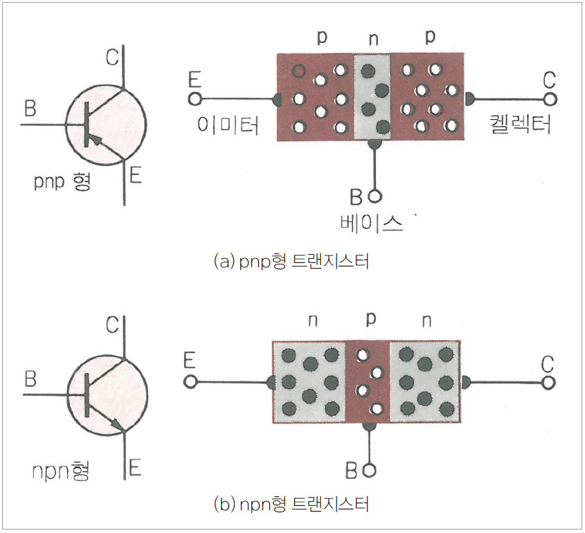
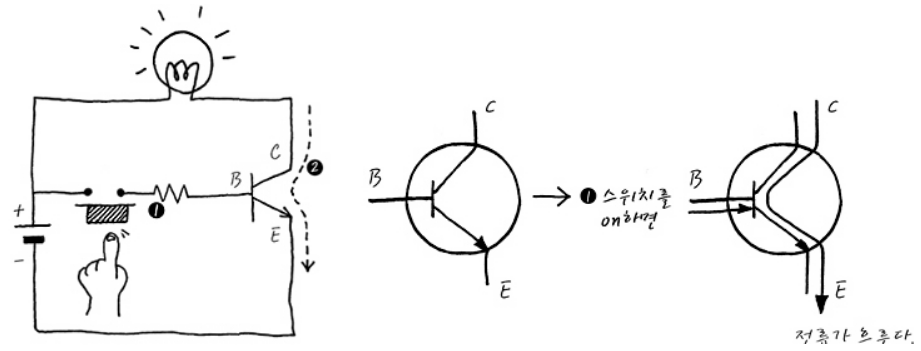

# Transistor
- Transistor는 Trans-Resistor다. 
- 역할
    - 증폭
    - 스위치 
- 간단한 회로이론에 의하여, Resistor값을 변화 시킬 수 있다는 의미다. 
- Resistor의 용도는 전류의 양을 조절하는 것이다. 
- 그럼 Transistor는 전류의 양을마음껏 조절할 수 있다는 말이다.
- 

# B, C, E
    - Collector : 물이 들어가는 입구
    - Emitor : 물이 나오는 출구
    - Base : 밸브 꼭지. 
    - Base와 Emitter에 흐르는 전류에 의해 밸브가 열리거나 닫히게 된다
    - 밸브가 닫히면 Collector로 들어온 물(전류)이 Output으로 많이 흐르게 되고
    - 밸브가 열리면 Collertor로 들어온 물(전류)이 emittor로 많이 흐르기 때문에 output으로 적은 물(전류)이 흐르게 된다. 
    - 밸브 꼭지를 조금만 돌려도 밸브가 많이 열린다면 증폭률이 좋은 transistor가 된다. 

# npn형 동작과정

- Base에 트랜지스터를 동작시킬만큼 전압이 인가되면, 마치 스위치가 눌리듯 collector와 emittor 사이에 회로가 연결 돼 collector로부터 emittor로 전류가 흐른다. 
- B를 얼마나 세게 누르냐, 즉 얼마나 큰 전압을 인가하느냐에 따라 C와 E 사이에 흐르는 전류의 세기가 변한다. 
- 인가하는 전압 크기에 따라 활성영역(active region), 차단영역(cut-off region), 포화영역(saturation region)으로 나뉜다.
- 활성영역 : 인가하는 전압 크기의 작은 변화량에 맞춰 전류도 함께 들쭉 날쭉 변화하는 영역을 말한다.
- 차단영역 : 인가하는 전압 크기가 너무 작아 전류가 흐르지 못하는 영역을 말한다. 
- 포화영역 : 인가하는 전압 크기가 너무 커서 전류 세기가 더 커지지 못하는 영역을 말한다. 
# 역할
    - 증폭기능 : 활성 영역을 사용하며 B에 인가하는 아주 작은 양의 전압 변화량에 맞춰 C와 E사이에 흐르는 전류가 큰 폭으로 들쭉날쭉 변화하는 현상을 이용해 구현한다. 
    - 스위칭 기능 : 차단영역을 0, 포화영역을 1이라고 정의하면 회로의 On/Off를 정의할 수 있다. 

 