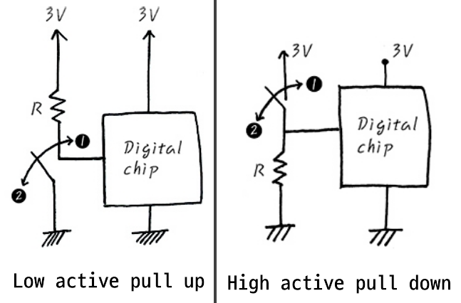

# Low Active & High Active
- 보통 디지털 시스템에서 핀에 인가되는 전압이 Logic 0일 때 동작 상태, 또는 Logic 1일 때 동작상태로 사용된다. (만다는 사람 마음대로 동작상태를 정하기 나름)
- 동작 상태를 active라고 한다
- Logic 0 동작 = Low Active
- Logic 1 동작 = High Active

# pull up & pull down

- Low active pull up 
    - switch on : 전압(전류)이 GND에 쏠리므로 chip에는 0V가 걸린다. Low active의 경우 이때, chip이 동작한다. 
    - switch off : 전압(전류)이 chip에 걸리므로 Low active의 경우, chip이 동작하지 않는다. 

- High active pull down 
    - switch on : chip에 전압이 걸리지 않으므로 작동하지 않는다.
    - switch off : chip에 전압이 걸리므로 작동한다. 

# pull up & pull down 이 필요한 이유 
- pull up & down은 Digital 신호의 기본적인 Default Level을 무엇으로 둘 것이냐의 문제인 것인데, 
- 원래 Ideal한 것으로 따지면 필요 없는 회로이어야 합니다만, real world라는 건 또 그리 만만한 것이 아니라서 필요한 거죠. - 예를 들어 High Active로 동작하는 Digital chip의 경우에 system이 정전기를 맞았거나, 사람이 칩을 만졌을 때, 외부 요인에 의하여 순간적으로 그때의 input이 High가 되어버린다면 Digital chip은 의도와 상관없이 동작하게 되는 경우가 있습니다. 
- 이런 시스템이만일 핵미사일 발사 시스템의 단추와 연관되어 있다면 그것참 무시무시한 일이 아닐 수 없습니다. 덜덜덜. 화장실 불을 켜는 정도라면 덜 위험할 수도 있긴 하지만, 조금 더 reliable하게 확실한 default 값을 보장하기 위해서 pull up이나 pull down이 회로 level에서 필요하게 되었습니다.

