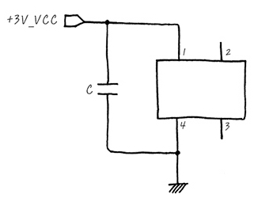
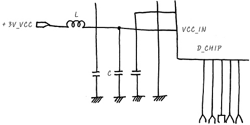
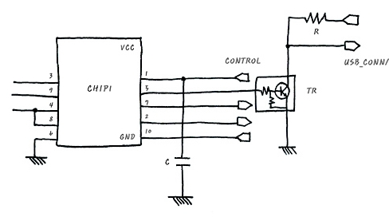
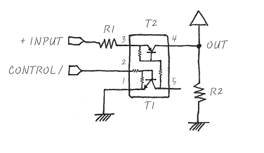

# Examples
- 지금까지 RLC, Transistor, Pull-up & Pull-down 회로에 대해서 익혔다.
- 이를 이용한 간단한 예제 회로를 살펴보겠다.

# ex1 - C

- chip에 3V DC 전원을 인가하기 위한 회로이다.
- C(capacitor, 축전기)는 AC인 고주파만 통과시킨다. 
- 3V 전원이 인가되면 AC 성분을 GND로 흘려 Chip에 들어가는 것을 차단한다. 
- 여기에서 AC는 전원 noise 따위다. 이렇듯 AC noise를 제거하는 것을 Ripple 제거라고도 한다. 적은 양의 DC의 흔들림을 ripple이라고 한다. 

# ex2 - L, C

- 이 회로에서 +3V_VCC가 전원이며, 이 전원이 D_CHIP의 VCC_IN에 drive되어 D_CHIP이 동작하도록 하는 것이다. 
- L(inductor) : AC에게는 큰 저항이다. 처음에 신호의 노이즈를 제거하기 위함.
- C(capacitor) : AC에게는 저항이 없으므로 AC 신호를 GND로 흘려 보낸다.
- 결과적으로 noise를 제거하기 위한 회로이다. 
- L 대신 R을 넣어도 되는가?
    - L대신 R을 넣고 사용해도 괜찮지 않겠는가 하는 의문이 들테지만, L을 넣는 경우는 보통 그냥 코일이 아니라, bead라고 부르는 Inductor의 한 종류를 삽입한다
    - 이 bead의 특성이 특정 주파수에서 저항의 역할을 톡톡히 하여, 마치 공진기 처럼 특정 주파수를 없애 버리는 역할도 같이 합니다. 
    - 결국 R을 넣으면, 전체적으로 줄어 들긴 하나 특정 주파수를 제거하지는 못하지만, L을 넣으므로서 AC를 전체적으로 죽이면서도 특정 주파수를 죽여버릴 수 있는 장점이 있습니다. 

# ex3 - USB_CONN/, TR, C, CONTROL

- 이 회로는 chip1에 CONTROL신호를 넣으면 USB_CONN/를 구동하는 
회로입니다.
- 작동 순서
    - 어떤 chip으로부터 CONTROL high drive 
    - chip 1은 pin 5에 high drive
    - TR ON
    - USB_CONN / Low drive로 active됨 (pull-down low active 회로)
- R, C의 용도도
    - Capacitor C : Control 신호가 CHIP1에 입력될 때, 쓸 데 없는 AC성분이 들어가지 않도록, AC를 GND로 흘려 보내는 역할을 한다
    - R : USB_CONN/이 Low active 이므로, 평상시 default상태를 High로 만들기 위한 +3V_VCC와 함께 Pull up을 하기 위한 것입니다.

#  ex4 - R, TR

- 이 회로는 npn형 T1, pnp형 T2 트랜지스터가 맞물려 있다.
- input으로는 +INPUT, CONTROL/가 있고, Output이 오른쪽 상단에 OUT port로 나와 있다.
 - 이 회로는 어떻게 동작하는 것일까, 일단 이 회로는 DC회로이며, CONTROL/에 의해서 control된다고 보면 됩니다. 이 회로는 R1과 +INPUT신호를 이용한 Pull up입니다. 
 - 일단 CONTROL/가 high일 때는 
    - T1이 ON되며, 이때 그렇게 되면 +INPUT은 3번 port와 5번 port를 따라 전압을 소진하게 되면서 동시에 T2가 ON 되지요. 
    - 5번 port는 T1이 ON이 됨에 의하여 1번 port의 GND에 연결되니까 그렇습니다. 그러므로 OUT으로 연결되는 T2가 ON 되었으니까 OUT에 INPUT가 거의 다 걸리게 되는거죠. 
 - 그러면 이번엔 반대 case인 CONTROL/의 신호가 low인 경우에는
    - 어떻게 되는가 하면, CONTROL이 Low가 되면서 T1이 off가 되고요, T2는 덩달아서 off가 되지요. 결국, +INPUT신호는 오갈 곳 없어 지는 거고 OUT에는 아무 것도 걸리지 않는 거지요. 
    - 결국 CONTROL/신호가 LOW일 때 OUTPUT에 아무것도 걸리지 않고, CONTROL/ 신호가 High일 때는 +INPUT신호가 OUT으로 나가게 되는 회로가 됩니다

