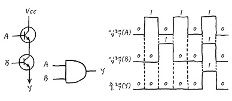
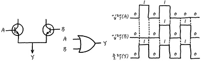
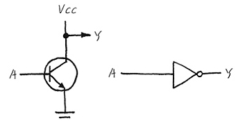
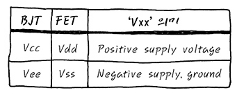

## AND GATE

- 트랜지스터 두개를 직렬로 연결하고, A와 B가 모두 입력되어야 TR이 모두 on이 되어 output으로 VCC가 출련된다. 

## OR GATE

- 트랜지스터 두개를 병렬로 연결하고, A와 B 중 어느 하나라도 1이라면 input vcc가 output로 나가는 형태 

## INVERTER

- inverter는 input을 반전시키는 일을 하며, 표시와 구현은 다음과 같이 합니다.
- switch로서의 TR의 역할에서 pull up할 때 봤던 회로이다.
- 보이는 바와 같이 A가 Logic 1일 때는 Y로 0이 출력되고, 0일 때는 Y로 1이 출력된다.

## 다양한 디지털 논리 회로

- 이런식으로 TR을 잘 이용하면, Logic gate들을 만들어 낼 수 있는데, 이런 Logic gate들을 이용해서 Digital Logic 회로를 만들어 내고, Logic회로들을 잘 조합하여 CPU를 만들어 낼 수도 있다

## 전압 notation

- BJT와 FET 사이에 사용하는 notation이 완전 다르다. 
- BJT (트랜지스터)
    - Vcc는 컬렉터 전원
    - Vee는 에미터 전원
- FET (FET는 BJT와 약간 다르게 Drain, Source, Gate로 다리가 구성되어 있다)
    - Vdd는 source 전원
    - Vss는 drain 전원
- 정리
    - Vcc, Vdd는 전원으로 연결된다.
    - Vee, Vss는 보통 ground로 연결된다. 
    - 근래에는 FET와 BJT가 혼합되어 마구 사용되어 그 부분이 모호해져서Vcc와 GND로 전원과 GND를 그냥 표시하는 일이 비일 비재해졌다. 

