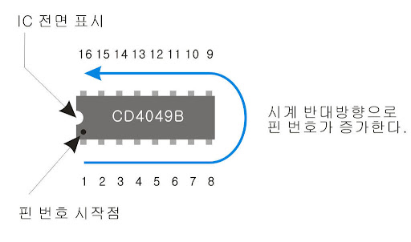
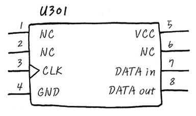

## IC칩 핀 번호 순서

## IC칩 보는 법

- 1번부터 8번까지 pin에 대한 설명이 대충 나와 있지요? 그림의 위에 U301이라고 쓰여져 있는 부분은 대부분의 Hardware Engineer들은 반도체 IC를 U라고 naming해서 회로도에 표기합니다. (UNIT 이라는 의미로..) 그런 이유로 저도 이런 말을 해야겠기에, 굳이 U301이라고 써 봤습니다. 다시 말해 301번 IC 라고 보시면 됩니다. 앞에 논리회로의 확장 편에서도 은근 슬적 IC에다가 U301이라고 표기했었는데, 눈치채셨는지 모르겠습니다. 후후.

- (참고로, Capacitor는 C301, Resistor는 R301, Inductor는 L301등으로 표시합니다.)

- 이때 각 pin에 대해 다시 한번 음미해 보면, 1, 2, 6번 pin의 NC는 No connection으로서 아무것도 연결하지 말라는 의미 입니다. 또는 아무런 기능이 없음을 나타내기도 하지요. 보통 이런 pin들은 어떻게 처리해야 하는지, Device spec을 잘 읽어 봐야 한답니다. 그냥 흘려 넘겼다가는큰코 다칠 수도 있어요.

- 그리고, 3번 pin의 clock에 대한 삼각형은 edge trigger를 의미합니다. edge trigger라는건 clock이 High, Low일때 IC가 동작하는게 아니라, 올라 갈 때 또는 내려갈 때 동작하는 것을 의미합니다. Clock 부분은 뒤에서 더 다루니까, 자세히 읽어 보세요.

- 4번은 Ground, 5번은 전원 VCC고요, 7, 8번은 Data in/ out을 의미합니다. 뭐 그렇다는 얘기죠.