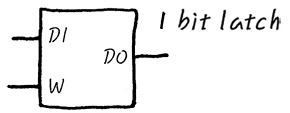
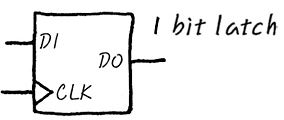

# 레지스터란
- CPU가 적은양의 데이터를 처리하는 동안의 중간 결과를 일시적으로 저장하기 위해 사용하는 고속의 기억회로.
- Register는 Flip-Flop의 조합.
- Flip-Flop이라는 것은 각각 1bit의 정보를 저장할 수 있는 것들을 의미한다. 
- Latch : 1비트, 즉 1또는 0인지를 기억할 수 있는 소자를 통칭하는 말이다. 
- 간단하게 설명하면 1비트를 기억하는 논리회로이다. 전원이 공급되는 한, 상태의 변화를 위한 신호(클럭)가 발생할 때까지 현재의 상태를 유지하는 논리회로이다. 레지스터를 구성하는 기본 소자로 2개의 NAND 또는 NOR 게이트를 이용하여 구성한다.

# 순차 회로 vs 조합 회로
- 순차회로 (Sequential Circuit)
    - 현재의 입력값 뿐만 아니라 이전에 발생한 입력값에 따라서도 출력을 결정하는 회로를 의미.
    - 
- 조합 회로 (Combinational Circuit)
    - 입력값에만 의존하여 출력을 결정하는 디지털 논리 회로.
    - 입력값의 조합에 따라 직접적으로 출력이 계산됨
    - 내부적으로 상태를 저장하거나 유지하지 않음.

# 회로

- 가장 간단한 형태의 Flip Flop이라는 것은 실은 NOR gate 두개의 output을 서로의 input으로 다시 feed back 하는 형태로 생겼습니다. R-S (Reset Set) F/F라고 부르기도 합니다. 잘 보시면, Data In은 data input이고, write는 Write Enable이라고 해서 Write TRUE가 되어야 Data In을 위쪽 AND gate나 아래쪽 AND gate로 넣을 수가 있습니다.

### 회로 이해하기
- write 신호는 항상 1이라고 가정한다.
    - write 신호가 0일 때는 Q값이 유지된다. 
- R (Q에 대한 Reset)
    - 
- S (Q에 대한 Set)

# Latch (래치)

- DI는 Data In, DO는 Data out, W는 Write Enable 신호
- 뭔가를 잠시 저장하는데 Latch들을 이용. 
- DO에 뭔가 Data processing 회로를 달아서 DO가 TRUE가 되는 순간 뭔가 일을 할 수 있게도 한다. 
- 이런걸 일컬어 **Level Trigger Latch**라고도 한다. 

# edge trigger latch 

# 레지스터 종류
- General Purpose Register
    - Address Register
    - Data Register
    - Instruction Pipeline Register

- Special Purpose Register
    - Program Counter
    - Linked Register
    - Status Register
    - I/O Register
