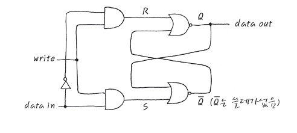

# 레지스터란
- CPU가 적은양의 데이터를 처리하는 동안의 중간 결과를 일시적으로 저장하기 위해 사용하는 고속의 기억회로.
- Register는 Flip-Flop의 조합.
- Flip-Flop이라는 것은 각각 1bit의 정보를 저장할 수 있는 것들을 의미한다. 
- Latch : 1비트, 즉 1또는 0인지를 기억할 수 있는 소자를 통칭하는 말이다. 

# 회로

- 가장 간단한 형태의 Flip Flop이라는 것은 실은 NOR gate 두개의 output을 서로의 input으로 다시 feed back 하는 형태로 생겼습니다. R-S (Reset Set) F/F라고 부르기도 합니다. 잘 보시면, Data In은 data input이고, write는 Write Enable이라고 해서 Write TRUE가 되어야 Data In을 위쪽 AND gate나 아래쪽 AND gate로 넣을 수가 있습니다.
