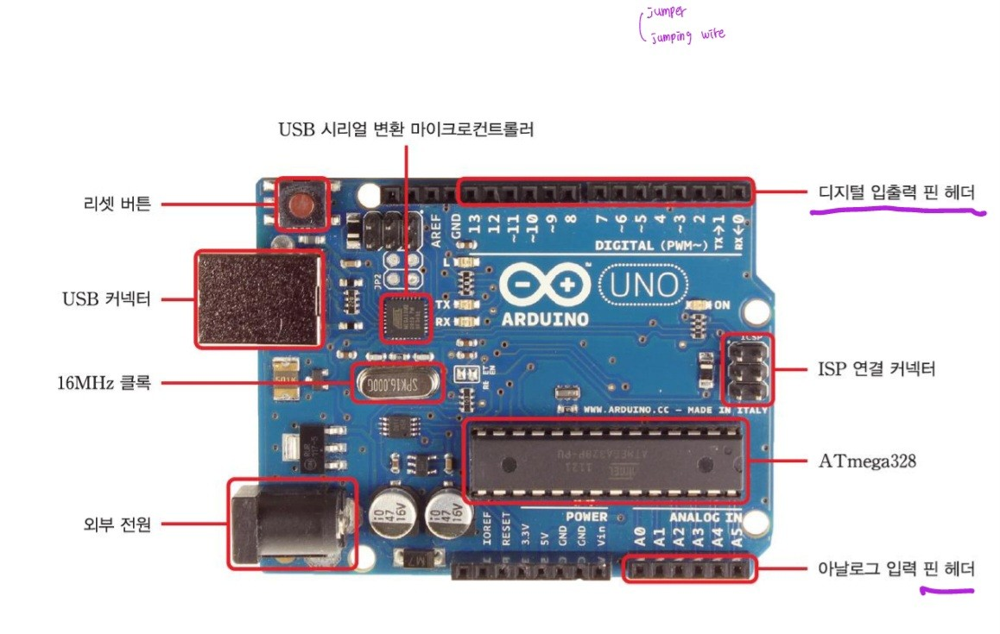

# 아두이노 보드 구성

# ARM이란? 
- Advanced RISC Machine

- RISC 란 (Reduced Instruction Set Coputer) 의 약자

- ARM 을 한국말로 직역하면 ( 고급 축소 명령어 세트 컴퓨터 기계 ) 

- ARM 은 일반 인텔 CPU계열의 CISC라는 명령어 구조보다는 간단한 RISC라는 명령어 구조 CPU 체계의 한 형식 이며

- 사물인터넷이나 모바일 안드로이드, 랩탑, 인터넷 모뎀, 디지털카메라, 닌텐도 등에 사용되는 CPU 체계이다.

- 다시 말하면 일반적인 데스크톱 PC에는 인텔 CPU나 AMD CPU에 대응해서 x86(32비트), x64(64비트), AMD64(64비트) 등의 CPU 명령체계가 들어가게 되고,

- ARM용 기기들에는 RISC 명령체계가 들어가게 된다. 

# MCU? CPU?
- Micro Controller Unit
    - 내부에 cpu와 ram, rom 등 다양한 장치가 집적돼있다.
    - 마이크로프로세서와 입출력 모듈을 하나의 칩으로 만들어 정해진 기능을 수행하는 컴퓨터를 말한다
- Central Processing Unit
    - 컴퓨터 시스템을 통제하고 프로그램의 연산을 실행 · 처리하는 가장 핵심적인 컴퓨터의 제어 장치, 혹은 그 기능을 내장한 칩이다
- 정리
    - MCU안에 CPU가 들어가있다.
    - MCU와 비슷한 것으로 SoC가 있다.
    - 임베디드 분야에서 쓰이는 MCU의 CPU는 ARM CPU이다. (STM32, ATmega32, ...)