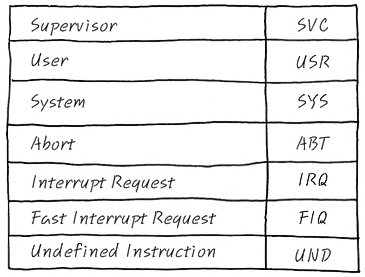
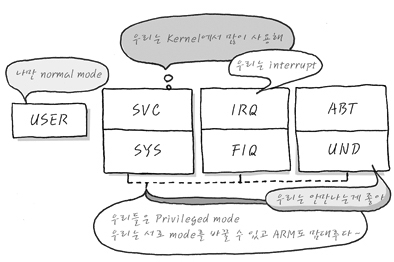

# Modes
- User Mode는 표준 사용자 mode라고 부르며, 나머지 6개 Mode는 Privileged mode라고 분류된다. ARM User Manual을 살펴 보면 그 Mode들의 설명이 아래와 같이 되어 있다.
- User : Normal Program execution mode
- System : Run privileged operating system tasks
- FIQ : When a high priority (fast) interrupt is raised
- IRQ : When a low priority (normal) interrupt is raised
- Supervisor : A protected mode for the operating system ,entered when a SWI instruction is executed
- Abort : Used to handle memory access violations
- Undef : Used to handle undefined instructions자,

# Mode의 약자

- User, System, Supervisor의 공통점
    - User Mode는 Application Program을 Execution 하는 Mode이고, - System Mode는 Privileged Operating system task가 실행되는 mode이고, 
    - Supervisor mode는 SWI instruction이 실행될 때, 사용되는 보호된 Operating system mode다.

# Mode 특징.

- Privileged Mode (특권 모드)는 IRQ나 FIQ등의 Interrupt의 사용 가능 유무를 직접 설정 할 수 있다.
- Privileged Mode는 자기들끼리, 자기네들 스스로 서로 Mode 변경이 자유자재로 가능하다, Normal Mode는 자기 스스로 Privileged Mode로 Mode의 변경이 불가능하다.
- 예를 들어, SYS ↔ FIQ, IRQ ↔ SVC과 같이 Privileged Mode → Normal Mode (USR)은 가능하지만, USR → Privileged Mode로의 변경은 불가능합니다. 아주 중요한 사실이다.
- 결국 Privileged Mode는 자기들 멋대로 Mode에 관한 한 자유롭게 왔다 갔다 할 수 있지만, USR Mode는 가능하지 않다는 사실. 

# Default Mode
- ARM의 default Mode는 무엇일까요? SVC Mode입니다. Supervisor Mode에서 출발해야 boot up시에 ARM에 대한 모든 권한을 행사할 수 있으니까 말이에요