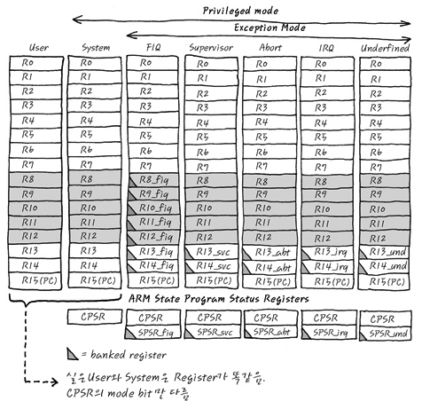
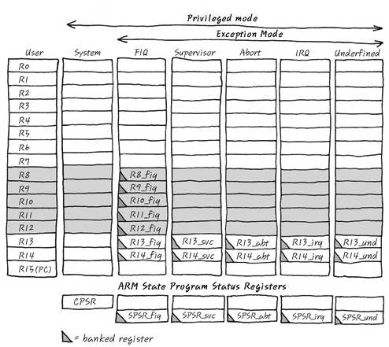
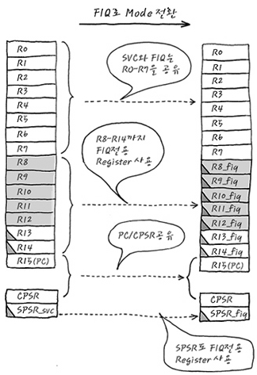
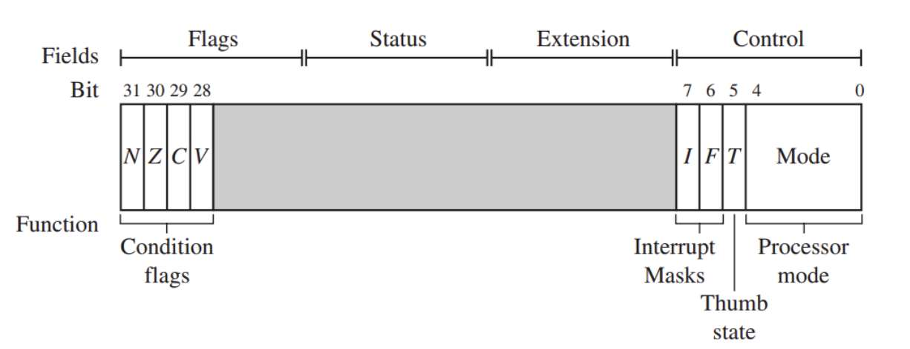

## 레지스터란?
- CPU가 요청을 처리하는데 필요한 데이터를 일시적으로 저장하는 다목적 공간

- 프로세스 내부에 있는 작은 공간이고 연산제어, 디버깅 등등의 목적으로 사용됨
- 레지스터를 이용하면 고속으로 데이터를 처리할 수 있다
- 레지스터는 (64, 32) 비트 머신을 구분하는 기준으로, 한번에 처리할 수 있는 비트 수이다.

## 레지스터 파일

- ARM core는 동작 mode가 바뀌면 사용하는 register set가 바뀐다. 
- ARM core는 37개의 register를 가진다. 
- 삼각형이 그려진 register들은 banked register라고 부르며 그것들만이 mode 별로 따로 있다.
- 나머지는 공용으로 사용

## 공유되는 레지스터 제외

## mode의 변환

## 레지스터 종류
- R0~R12
    - CPU의 동작 중 저장용도로 사용된다.
- R13 (Stack Pointer, SP)
    - 현재 stack을 어디까지 쌓아두었는지 가리키는 register
- R14 (Link Register, LR)
    - ARM이 어디론가 분기하기 전에 돌아올 위치를 저장해 놓는 register
- R15 (Program Counter, PC)
    - 다음에 실행할 명령어의 주소값을 저장해 놓는 register
- CPSR (Current Program Status Register)
    - 현재 status를 저장하는 register
    
- SPSR (Saved Program Status Register)
    - CPSR 값을 복사하여 백업해 놓는 register 
    - SPSR에 CPSR값을 백업하고 mode를 바꾼 뒤, 다시 SPSR 값을 CPSR에 넣으면 이전 mode로 돌아갈 수 있다. 
