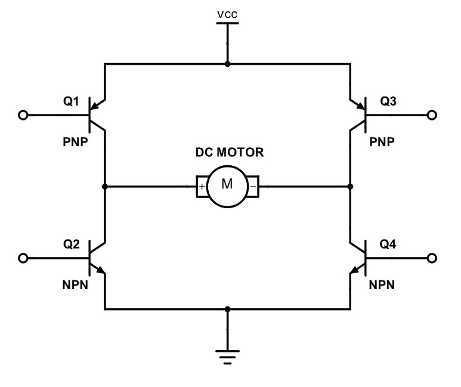
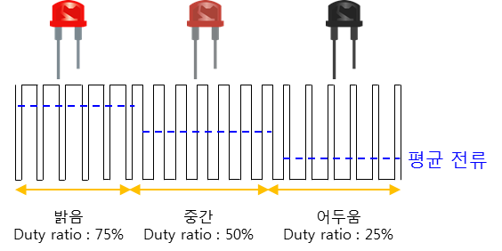

# 모터가 돌어가는 원리

- 회전방향 : (Q1 & Q2) or (Q3 & Q2)에 전압을 가하게 되면 전류가 흐르면서 모터가 회전하게 된다. 
- 회전속도 : PWM을 통해 제어가능

# PWM (pulse width modulation)
- 디지털 신호 0, 1을 빠르게 반복해서 마치 평균처럼 보이게 하면 아날로그 효과를 낼 수 있지 않을까라는 아이디어가 PWM이 된 것입니다. 
- HIGH와 LOW를 반복하는 펄스파이며, HIGH가 되는 시간을 조절하여 제어를 합니다. 
- 
- 위의 그림과 같이 신호가 HIGH인 구간이 길면 LED가 밝고, 신호가 LOW인 구간이 길면 LED가 어두워지는 것이다. 
- 이를 어려운 말로 duty ratio를 조절한다고 표현. 
- **duty ratio**는 0~100%로 표현
    - 0%는 0V DC 전압, 
    - 100%는 5V DC 전압. 
    - 위의 그림에서 밝음의 경우 duty ratio는 75% 
    - 중간의 경우 50%, 
    - 어두움의 경우 25%입니다.

# 타이머, 카운터
- prescaler : 타이머의 클럭 주파수 결정
    - 72MHz 시스템 클럭을 가진 mcu의 prescaler 값이 71이라면 타이머의 주파수는 1MHz가 된다.

- period : PWM의 주기를 결정
    - prescaler 값을 71로 가정
    - 주기를 999로 하게되면 PWM의 주기는 1kHz 

- pulse : 매우 짧은 동안만 흐르는 전류
    - pulse 값을 통해 PWM의 duty-cycle 정할 수 있다.
    - pulse를 period/2로 설정하면 duty-cycle = 50%


# stm32 예시 코드
```c
/* Includes ------------------------------------------------------------------*/
#include "main.h"

/* Private variables ---------------------------------------------------------*/
TIM_HandleTypeDef htim2;

/* Private function prototypes -----------------------------------------------*/
void SystemClock_Config(void);
static void MX_GPIO_Init(void);
static void MX_TIM2_Init(void);

/**
  * @brief  The application entry point.
  * @retval int
  */
int main(void)
{
  /* MCU Configuration--------------------------------------------------------*/
  HAL_Init();
  SystemClock_Config();
  MX_GPIO_Init();
  MX_TIM2_Init();

  /* Start PWM signal generation */
  HAL_TIM_PWM_Start(&htim2, TIM_CHANNEL_1);

  /* Infinite loop */
  while (1)
  {
    /* Adjust the duty cycle to control motor speed */
    __HAL_TIM_SET_COMPARE(&htim2, TIM_CHANNEL_1, 3600); // 50% duty cycle
    HAL_Delay(1000); // 1 second delay
    
    __HAL_TIM_SET_COMPARE(&htim2, TIM_CHANNEL_1, 5400); // 75% duty cycle
    HAL_Delay(1000); // 1 second delay
    
    __HAL_TIM_SET_COMPARE(&htim2, TIM_CHANNEL_1, 1800); // 25% duty cycle
    HAL_Delay(1000); // 1 second delay
  }
}

/**
  * @brief TIM2 Initialization Function
  * @param None
  * @retval None
  */
static void MX_TIM2_Init(void)
{
  TIM_ClockConfigTypeDef sClockSourceConfig = {0};
  TIM_MasterConfigTypeDef sMasterConfig = {0};
  TIM_OC_InitTypeDef sConfigOC = {0};

  htim2.Instance = TIM2;
  htim2.Init.Prescaler = 0;
  htim2.Init.CounterMode = TIM_COUNTERMODE_UP;
  htim2.Init.Period = 7199; // For 10kHz PWM with 72MHz clock
  htim2.Init.ClockDivision = TIM_CLOCKDIVISION_DIV1;
  if (HAL_TIM_Base_Init(&htim2) != HAL_OK)
  {
    Error_Handler();
  }
  sClockSourceConfig.ClockSource = TIM_CLOCKSOURCE_INTERNAL;
  if (HAL_TIM_ConfigClockSource(&htim2, &sClockSourceConfig) != HAL_OK)
  {
    Error_Handler();
  }
  if (HAL_TIM_PWM_Init(&htim2) != HAL_OK)
  {
    Error_Handler();
  }
  sMasterConfig.MasterOutputTrigger = TIM_TRGO_RESET;
  sMasterConfig.MasterSlaveMode = TIM_MASTERSLAVEMODE_DISABLE;
  if (HAL_TIMEx_MasterConfigSynchronization(&htim2, &sMasterConfig) != HAL_OK)
  {
    Error_Handler();
  }
  sConfigOC.OCMode = TIM_OCMODE_PWM1;
  sConfigOC.Pulse = 3600; // 50% duty cycle
  sConfigOC.OCPolarity = TIM_OCPOLARITY_HIGH;
  sConfigOC.OCFastMode = TIM_OCFAST_DISABLE;
  if (HAL_TIM_PWM_ConfigChannel(&htim2, &sConfigOC, TIM_CHANNEL_1) != HAL_OK)
  {
    Error_Handler();
  }
}

static void MX_GPIO_Init(void)
{
  /* GPIO Ports Clock Enable */
  __HAL_RCC_GPIOA_CLK_ENABLE();
}

void SystemClock_Config(void)
{
  RCC_OscInitTypeDef RCC_OscInitStruct = {0};
  RCC_ClkInitTypeDef RCC_ClkInitStruct = {0};

  RCC_OscInitStruct.OscillatorType = RCC_OSCILLATORTYPE_HSE;
  RCC_OscInitStruct.HSEState = RCC_HSE_ON;
  RCC_OscInitStruct.HSEPredivValue = RCC_HSE_PREDIV_DIV1;
  RCC_OscInitStruct.HSIState = RCC_HSI_ON;
  RCC_OscInitStruct.PLL.PLLState = RCC_PLL_ON;
  RCC_OscInitStruct.PLL.PLLSource = RCC_PLLSOURCE_HSE;
  RCC_OscInitStruct.PLL.PLLMUL = RCC_PLL_MUL9;
  if (HAL_RCC_OscConfig(&RCC_OscInitStruct) != HAL_OK)
  {
    Error_Handler();
  }

  RCC_ClkInitStruct.ClockType = RCC_CLOCKTYPE_HCLK|RCC_CLOCKTYPE_SYSCLK
                              |RCC_CLOCKTYPE_PCLK1|RCC_CLOCKTYPE_PCLK2;
  RCC_ClkInitStruct.SYSCLKSource = RCC_SYSCLKSOURCE_PLLCLK;
  RCC_ClkInitStruct.AHBCLKDivider = RCC_SYSCLK_DIV1;
  RCC_ClkInitStruct.APB1CLKDivider = RCC_HCLK_DIV2;
  RCC_ClkInitStruct.APB2CLKDivider = RCC_HCLK_DIV1;

  if (HAL_RCC_ClockConfig(&RCC_ClkInitStruct, FLASH_LATENCY_2) != HAL_OK)
  {
    Error_Handler();
  }
}

void Error_Handler(void)
{
  while(1) 
  {
  }
}

#ifdef  USE_FULL_ASSERT
void assert_failed(uint8_t *file, uint32_t line)
{ 
}
#endif /* USE_FULL_ASSERT */
```