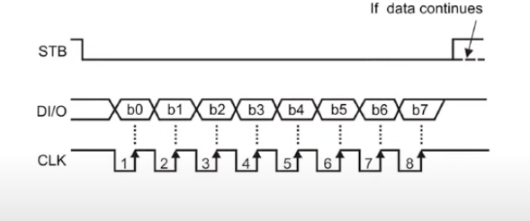

# 칩과 칩이 통신하는 인터페이스
- Uart
- Rs232, rs485
- SPI
- I2c
- TCP, UDP
- CAN

# SPI
- Serial Peripharal Interface Bus
- 
- SPI는 어떻게 데이터를 보내는지는 정의되어 있음
- SPI는 어떤 데이터를 보내야 할지는 정해있지 않음

- STB (Stand by): STB는 "스트로브(Strobe)"의 줄임말이며, 일반적으로 데이터를 전송하기 전에 장치에게 데이터를 준비할 시기를 알리는 신호입니다. 이는 데이터가 유효한지를 나타내는 신호이며, 데이터가 전송될 준비가 되었음을 나타냅니다.
- DI/O (Data Input/Output): DI/O는 "데이터 입력/출력(Data Input/Output)"의 줄임말이며, 이것은 데이터가 주고받는 부분을 가리킵니다. STB 신호와 함께 사용되어 데이터가 전송되거나 수신되는 타이밍을 정의합니다.
- CLK (Clock): CLK는 "클록(Clock)"의 줄임말로, 데이터 전송의 타이밍을 제어하는 신호입니다. 클록은 데이터 비트를 전송하는 각 사이클을 동기화하는 데 사용됩니다.

# Uart

# Rs232, rs485

# I2c

# TCP, UDP

# CAN

# Datasheet tip
- Functional Description : 어떤 데이터를 보내야 회로가 작동하는지 설명해줌. 즉, 어떻게 코딩해야 하는지 알려줌. 

# Clock과 타이머
- PWM

# 새로운 모듈에 대한 접근 & 조작법
- 데이터시트를 찾을 수 없는 경우 혹은 있는 경우에도 
**샘플코드**를 구해서 디버깅 및 테스트를 통해 모듈을 이해하는 것이 가장 빠르다. 
- 샘플코드를 구할 수 없을 때 아두이노 코드를 변환해보자. 