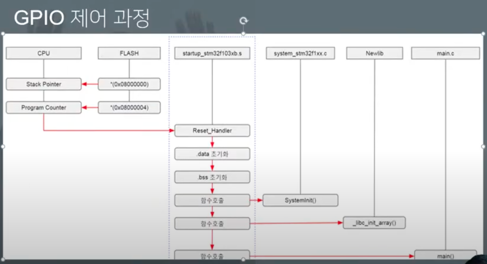

# 프로젝트 실행과정
- POWER ON -> Startup Code -> main()

# GPIO (input/output)
- GPIO를 "input" 또는 "output"으로 설정하는 것은 해당 GPIO pin의 동작 방식을 결정하는 것이다
- input 
    - GPIO를 입력으로 설정하면 외부에서 해당 핀으로 들어오는 전압을 읽을 수 있다.
    - 외부 장치가 해당 핀에 데이터를 제공하는 것을 가능하게 한다. 
    - 예를 들어, 버튼의 상태를 감지하거나 센서에서 데이터를 읽을 수 있다. 
- output
    - GPIO를 출력으로 설정하면 해당 핀에서 전압을 생성하여 외부에 신호를 보낼 수 있다.
    - LED를 켜거나 다른 디지털 장치를 제어할 때 사용할 수 있다.
    - 출력으로 설정된 GPIO 핀은 프로그램에서 제어하여 해당 핀에 전압을 인가하거나 인가하지 않을 수 있다. 
    
# GPIO 제어 과정

1. Main() ->
2. HAL_Init() -> 주변장치 리셋, 플래쉬 인터페이스 초기화, systik 설정
3. SystemClock_Config() -> 시스템 클럭 설정
4. MX_GPIO_Init() -> __HAL_RCC_GPIOC_CLK_ENABLE(); -> GPIO C포트 클럭 활성화
5. HAL_GPIO_Init(GPIO_LED_GPIO_Port, &GPIO_InitStruct); -> GPIO 옵션 설정

- 클럭을 키면 전류를 더욱 사용한다. 극한으로 전류를 아껴야 하는 상황에는 Sleep 모드 뿐만 아니라, 클럭도 하나 하나 전부 제어해야 한다. 

# RCC
임베디드 시스템에서 RCC는 "Reset and Clock Control"의 약자입니다. 이는 마이크로컨트롤러나 마이크로프로세서와 관련된 핵심 하드웨어 모듈 중 하나입니다. RCC는 시스템의 리셋과 클럭을 제어합니다. 리셋은 시스템을 초기 상태로 되돌리는 것이고, 클럭은 시스템의 작동 주기를 정의합니다. RCC는 클럭 신호를 생성하고 분배하는 역할을 수행하여 시스템의 안정성과 성능을 유지합니다. 이는 임베디드 시스템에서 중요한 역할을 합니다.

# 클럭의 개념
- STM32 시스템에 클럭을 공급하는 방법은 HSI, HSE, PLL이 있다.
    - PLL (Phase Locked Loop) : HSI나 HSE를 클럭 소스로 사용한다. 이렇게 설정된 클럭이 시스템 클럭이다(SYSCLK).
    - HSI(Internal High-speed Clock) - 내부 RC 오실레이터의 주파수 클럭 소스로 사용한다.
    - HSE(External High-speed Clock) - 외부에 부착한 크리스탈이나 오실레이터의 주파수를 클럭 소스로 사용한다.
    - 크게 AHB(Advanced High performance Bus), APB2, APB1 3개의 버스에 물려있는 장치들에게 공급

