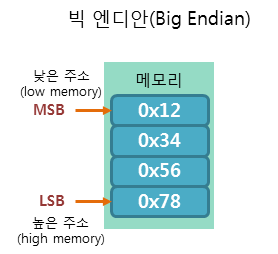
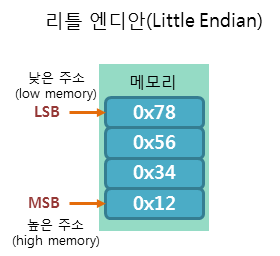

# 바이트 저장 순서
- big endian
    - 빅 엔디안 방식은 낮은 주소에 데이터의 높은 바이트(MSB, Most Significant Bit)부터 저장하는 방식입니다.
    - 이 방식은 평소 우리가 숫자를 사용하는 선형 방식과 같은 방식입니다.
    - 따라서 메모리에 저장된 순서 그대로 읽을 수 있으며, 이해하기가 쉽다는 장점을 가지고 있습니다.
    - SPARC을 포함한 대부분의 RISC CPU 계열에서는 이 방식으로 데이터를 저장합니다.
    - 예시 (0x12345678)
    - 
- little endian
    - 리틀 엔디안 방식은 낮은 주소에 데이터의 낮은 바이트(LSB, Least Significant Bit)부터 저장하는 방식입니다.
    - 이 방식은 평소 우리가 숫자를 사용하는 선형 방식과는 반대로 거꾸로 읽어야 합니다.
    - 대부분의 인텔 CPU 계열에서는 이 방식으로 데이터를 저장합니다.
    - 앞서 예를 든 정수 "0x12345678"를 리틀 엔디안 방식으로 저장하면 다음 그림과 같이 저장됩니다.
    - 

# 저장순서 확인하기
```c
#include <stdio.h>

int main(){
    int a = 0x12345678;
    char *cp = (char*)&a;

    for(int i=0; i<sizeof(int); i++){
        printf("%x", *cp);
        cp++;
    }


    return 0;
}

// big : 1234567 출력됨
// little : 78563412 출력됨
```


