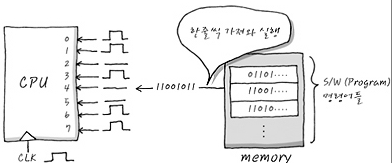

# 비트 패턴
- 프로그램이란 이런 일련의 기계어 명령의 순차적인 집합이며, - Assembly라는 개념을 도입하게 되었는데, Native Code(기계어)와 1:1 matching이 되는 그나마 사람이 보기 쉬운 표기 체제를 만들어 냈습니다. 
- 예를 들어 Memory에 Data를 읽어 오는 "LDR R0,= 0xFF"를 bit pattern으로 분석했더니, 0x3CD1FF과 완전히 같은 말이며, 이것은 bit pattern으로는 1111001101000111111111이 된다. 
- 이것들은 서로 완전히 1:1 대응이 되어 Assembly로 표현 되었을 때 사람이 보기에 훨씬 편하게 됩니다.

# 컴파일의 의미
- ARM core를 예를 들어보겠다.
- C로 coding을 한 후, compile한다는 의미는 C compiler를 이용하여, ARM이 해석 할 수 있는 Assembly를 만들어 낸 후
- ARM Assembler를 이용하여, ARM core가 해석할 수 있는 일련의 Bit pattern의 만들어 낸다고 할 수 있겠습니다. 
- 이런 bit pattern을 한 덩어리 뭉쳐놓은 것을 흔히들 말하는 Executable binary image라고 합니다.
- 

# mnemonic
 - mnemonic은 사람의 기억을 돕기 위하여 사용되는 Symbol을 의미한다
 - 결국 assembly는 기계어와 1:1로 matching되므로 Assembly 코드를 mnemonic이라고 불러도 무방합니다. 
 - 중요한 것은 이렇게 메모리 안에 들어 있는 숫자들이 CPU가 가져다가 실행하면 명령어고, 수정하거나 고치면 데이터라는 사실

# cross compile
 - Cross Compile이란 실제 Target에서 돌아갈 binary image를 PC 상에서 compile 할 수 있게 해주는 환경을 말합니다. 
 - 흔히 PC에서 컴파일 한 것은 PC에서 실행하는 게 정상이다.
 - embedded system에서는 target 자체에서 컴파일을 수행하기에 너무 작은 시스템이다.
 - 크로스 컴파일이란 결국 binary image를 PC상에서 만들어 target에 이식해 실행시키는 것이다. 
 

