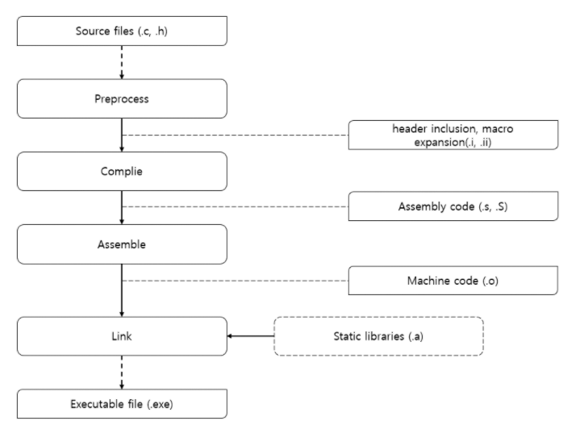
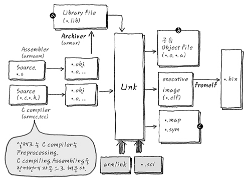

# 개요

# 컴파일 과정

1. 전처리 
2. assembly 
3. elf 형식의 .o file 생성

- lib file은 source code를 제공하고 싶지 않은 개발자가 object 형식으로 미리 컴파일 하여 제공하고, lib은 다른 컴파일 된 object들과 link 되어 같이 물려 들어가는 형식을 취한다. 
- link 시에 scl이라는 것이 새로 들어간다. 이것은 Scatter loading이라고 부르며, binary를 만들어 낼 때, 메모리의 주소 구성을 원하는 대로 주물럭 댈 수 있게 해주는 script file이다.
- Map file이나 Sym file은 compile 된 binary의 메모리 구성을 나타내 주는 text file이다. 보통 compiler option을 줘서 만들어 낼 수 있는 option file

# ADS
- ADS는 ARM에서 파는 ARM Developer's Suit, 즉 크로스 컴파일러다. 
- GNU 진영의 ARM GCC도 있다. 
- 그 외 다양한 컴파일러가 있다. 